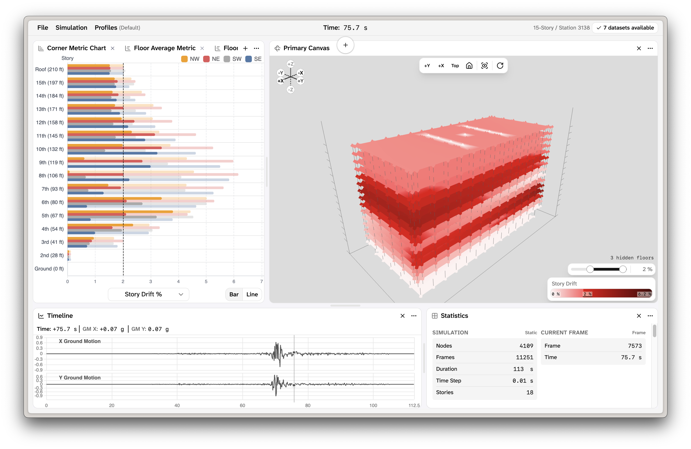
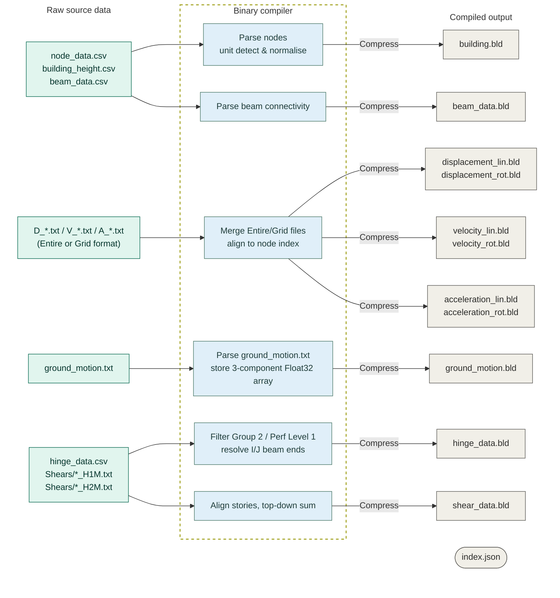

# Quakes

**Interactive seismic response visualization for tall building structural simulations**

Quakes is a research tool for exploring time-history structural response data from building simulations. It renders building models in an interactive 3D scene, animates node displacements frame-by-frame, and shows a variety of metrics including interstory drift, story shear, and hinge demand summaries, across and interactive interface.



## Features

**3D animated building response**
A visualization of the building showing nodes, beam connections, floor slabs, and hinges. Moves in realtime to watch the simulation data. Toggleable floors and building slice visibility to narrow in on one part of the building. Scalable node displacement and positions to get better visibility on the motion. Quick camera presets and full orbit controls allow viewing the building from any angle. Visualize any metric across the entire building and set thresholds to highlight area of interest for values that get too high.

**Dockable analysis panels**
The interface uses a dockview layout that can be arranged freely. Available panels include:

- _Floor waveform_ — time-series waveforms showing the average value of each floor
- _Hinge distribution_ — histograms for showing peak hinge rotational distributions
- _Corner metric chart_ — showing the a metric value at each corner on every floor
- _Node/Floor/Cross Section Panels_ — view data and graphs for individual nodes, floors, and X/Y cross-sections of the building

**Export**
The interface supports exporting video of the 3D building playback and data graphs. Both DOM capture and canvas-native paths are supported.

**Data profiles**
Named profiles (Displacements, Hinges, Shear, Story Drifts) for easy switching between both panel layout and datasets. With on demand data loading, the browser loads only the three required startup files before the interface becomes usable. Optional datasets are fetched and parsed incrementally with a background worker.

## Data pipeline

Before the data is loaded into the viewer, it gets processed to remove uneccessary data and reduce file sizes. The processing pipeline converts raw structural analysis output (PERFORM-3D / LADWP text exports, hinge CSVs, data csvs) into compact gzip-compressed binary files (`.bld`) served from Cloudflare R2.

### Data Processing



---

## Primary Technology

- _Rendering_ - Three.js, React Three Fiber, React Three Drei
- _Charts_ - Apache ECharts
- _UI framework_ - React 19, Tailwind CSS v4, shadcn/ui, Radix UI
- _Export_ - @ffmpeg/ffmpeg (WASM), MediaRecorder API, JSZip

---

## Building & Running

**Python pipeline** (data preparation only)

```
python >= 3.9
numpy
pandas
```

Install with `pip install -r scripts/requirements.txt`.

Run the build script: `python3 scripts/generate_binary_data.py`

**JavaScript / browser app**

Install dependencies: `pnpm install`

Run locally: `pnpm dev`

Build: `pnpm build`

---

<!--
## Citation

If you use this tool or the associated datasets in published research, please cite:

```

[Author(s)]. (Year). Quakes: Interactive seismic response visualization
for tall building structural simulations [Software].
[Institution/Repository URL]

```

---

## License

[Add license here]

---

## Contact

```
```
 -->

---

## Acknowledgments

This project was developed as part of the **JPL/Caltech/ArtCenter Data to Discovery Program**, in collaboration with **NASA JPL**.

- **Aidan Schmitigal** — Primary development
- **Esther Suh** — Design
- **Monica Kohler** & **Viviana Vela** — Research & data
