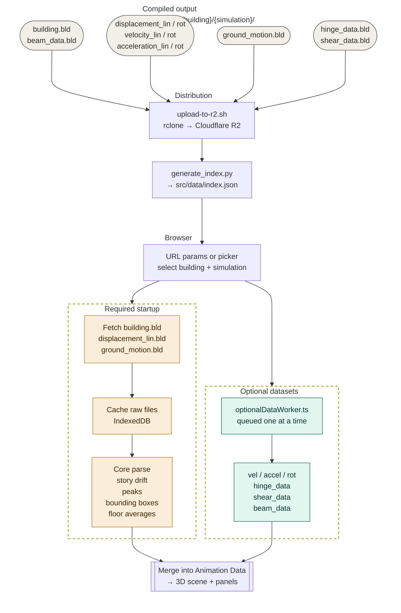

```mermaid
flowchart TD

  subgraph OUT["Compiled output  <br>  data/binary/{building}/{simulation}/"]
    direction LR
    C1(["building.bld<br>beam_data.bld"])
    C2(["displacement_lin / rot<br>velocity_lin / rot<br>acceleration_lin / rot"])
    C3(["ground_motion.bld"])
    C4(["hinge_data.bld<br>shear_data.bld"])
  end

  subgraph DIST["Distribution"]
    direction LR
    D1["upload-to-r2.sh<br>rclone → Cloudflare R2"]
    D2["generate_index.py<br>→ src/data/index.json"]
  end

  subgraph BROWSER["Browser  <br>  AnimationDataProvider"]
    direction TB
    E1["URL params or picker<br>select building + simulation"]

    subgraph REQ["Required startup  <br>  loads first"]
      direction LR
      E2["Fetch building.bld<br>displacement_lin.bld<br>ground_motion.bld"]
      E3["Cache raw files<br>IndexedDB"]
      E4["Core parse<br>story drift <br> peaks<br>bounding boxes <br> floor averages"]
      E2 --> E3 --> E4
    end

    subgraph OPT["Optional datasets  <br>  background worker"]
      direction LR
      E5["optionalDataWorker.ts<br>queued one at a time"]
      E6["vel / accel / rot<br>hinge_data <br> shear_data<br>beam_data"]
      E5 --> E6
    end

    E7[["Merge into Animation Data<br>→ 3D scene + panels"]]

    E1 --> REQ
    E1 --> OPT
    E4 --> E7
    E6 --> E7
  end

  C1 & C2 & C3 & C4 --> D1
  D1 --> D2
  D2 --> E1

  classDef required fill:#FAEEDA,stroke:#BA7517,color:#412402
  classDef optional fill:#E1F5EE,stroke:#0F6E56,color:#04342C
  classDef compiler fill:#EEEDFE,stroke:#534AB7,color:#26215C
  classDef out fill:#F1EFE8,stroke:#5F5E5A,color:#2C2C2A

  class E2,E3,E4 required
  class E5,E6 optional
  class B1,B2,B3,B4,B5,B6,B7 compiler
  class C1,C2,C3,C4 out

  style BROWSER fill:#FFFFFF,stroke-width:0px
  style OUT fill:#FFFFFF,stroke-width:0px
  style DIST fill:#FFFFFF,stroke-width:0px
  style REQ fill:#FFFFFF,stroke-width:2px,stroke-dasharray:5 5
  style OPT fill:#FFFFFF,stroke-width:2px,stroke-dasharray:5 5
```
